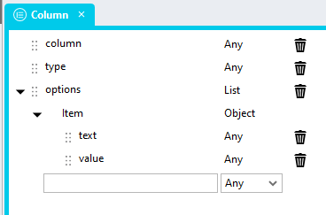
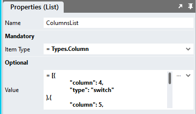

# DataGrid Inline Column Editing

This module shows how to enable the immediate editing of data contained in a specific DataGrid column

https://github.com/stadium-software/datagrid-inline-column-edit/assets/2085324/2abeaf5e-b020-4b35-86df-cc011f0a870e

# Contents
- [DataGrid Inline Column Editing](#datagrid-inline-column-editing)
- [Contents](#contents)
- [Version](#version)
- [Setup](#setup)
  - [Types Setup](#types-setup)
    - [Option](#option)
    - [Column](#column)
  - [Global Script Setup](#global-script-setup)
  - [Page-Script Setup](#page-script-setup)
  - [Page Setup](#page-setup)
  - [Page.Load Event Setup](#pageload-event-setup)
  - [Checkbox Switch Display](#checkbox-switch-display)
  - [Applying the CSS](#applying-the-css)
  - [Customising CSS](#customising-css)
  - [CSS Upgrading](#css-upgrading)

# Version 
2.0 Consolidated disparate column scripts into one

# Setup

## Types Setup
Create two types

### Option
Add a type called "Option" with the following properties
1. text (Any)
2. value (Any)


### Column
Add a type called "Column" with the following properties
1. column (Any)
2. type (Any)
3. options (List)
   1. Item (Types.Option)



## Global Script Setup
1. Create a Global Script called "ColumnEditing"
2. Add the input parameters below to the Global Script
   1. CallbackScript
   2. Columns
   3. DataGridClass
3. Drag a *JavaScript* action into the script
4. Add the Javascript below into the JavaScript code property
```javascript
/* Stadium Script Version 2.0 https://github.com/stadium-software/datagrid-inline-column-edit */
let scope = this;
let callback = ~.Parameters.Input.CallbackScript;
let dgClassName = "." + ~.Parameters.Input.DataGridClass;
let dg = document.querySelectorAll(dgClassName);
if (dg.length == 0) {
    dg = document.querySelector(".data-grid-container");
} else if (dg.length > 1) {
    console.error("The class '" + dgClassName + "' is assigned to multiple DataGrids. DataGrids using this script must have unique classnames");
    return false;
} else { 
    dg = dg[0];
}
if (dg.querySelector(".data-grid-search-box")) {
    console.warn("Datagrid search is not supported with the inline-column-edit module. The search box has been hidden");
    dg.querySelector(".data-grid-header > .form-group.input-group").style.display = "none";
    dg.querySelector(".data-grid-header > .data-grid-search-help-button").style.display = "none";
}
dg.classList.add("datagrid-inline-column-editing");
let table = dg.querySelector("table");
let columns = ~.Parameters.Input.Columns;
let options = {
    childList: true,
    subtree: true,
};
let observer = new MutationObserver(setupColumns);
let options2 = {
    characterData: true,
    subtree: true,
};
let observer2 = new MutationObserver(setValues);
let isCheckbox = ["checkbox","checkboxes"];
let isDropDown = ["dropdown","dropdowns"];
let isRadioButton = ["radiobutton","radiobuttons","radio","radios"];
let isSwitch = ["switch","switches"];
    
setupColumns();

/*Main*/
let changeEventCallback = async (e) => {
    let el = e.target;
    let parent = el.closest("td");
    let els = parent.querySelectorAll(".inline-container");
    let text;
    if (e.target.tagName.toLowerCase() == "select") {
        text = el.options[e.target.selectedIndex].text;
        parent.setAttribute("cell-value", el.value);
    } else if (e.target.tagName.toLowerCase() == "input" && el.type == "radio") {
        text = el.closest("div").querySelector("label").innerText;
        parent.setAttribute("cell-value", el.value);
    } else if (e.target.tagName.toLowerCase() == "input" && el.type == "checkbox") {
        text = "Yes";
        if (parent.innerText == "Yes") {
            text = "No";
        }
    }
    parent.innerText = text;
    for (let i = 0; i < els.length; i++) {
        parent.appendChild(els[i]);
    }
    let row = e.target.closest("tr");
    let data = rowToObj(table, row);
    await scope[callback](data);
};

function setupColumns(){
    if (table.querySelectorAll("tbody tr").length < 2) {
        observer.observe(table, options);
        return false;
    }
    observer.disconnect();
    for (let i = 0; i < columns.length; i++) {
        if (isCheckbox.includes(columns[i].type)) {
            setupCheckboxes(columns[i].column);
        } else if (isDropDown.includes(columns[i].type)) {
            setupDropdowns(columns[i].column, columns[i].options);
        } else if (isRadioButton.includes(columns[i].type)) {
            setupRadioButtons(columns[i].column, columns[i].options);
        } else if (isSwitch.includes(columns[i].type)) {
            setupCheckboxes(columns[i].column);
            setupSwitches(columns[i].column);
        }
    }
    setValues();
}
function setValues(){
    observer2.disconnect();
    for (let i = 0; i < columns.length; i++) {
        if (isCheckbox.includes(columns[i].type)) {
            setCheckboxValues(columns[i].column);
        } else if (isDropDown.includes(columns[i].type)) {
            setDropdownValues(columns[i].column, columns[i].options);
        } else if (isRadioButton.includes(columns[i].type)) {
            setRadioButtonValues(columns[i].column, columns[i].options);
        } else if (isSwitch.includes(columns[i].type)) {
            setCheckboxValues(columns[i].column);
        }
    }
    observer2.observe(table, options2);
}

/*Checkbox Columns*/
function setupCheckboxes(colNo) {
    let cells = table.querySelectorAll("tr td:nth-child(" + colNo + ")");
    for (let i = 0; i < cells.length; i++) {
        cells[i].classList.add("inline-column-cell");
        let input = document.createElement("input");
        input.classList.add("inline-container");
        input.setAttribute("type", "checkbox");
        input.id = i + "_" + Math.floor(Math.random() * 10000);
        input.addEventListener("change", changeEventCallback);
        cells[i].appendChild(input);
    }
}
function setCheckboxValues(colNo) {
    let cells = table.querySelectorAll("tr td:nth-child(" + colNo + ")");
    for (let i = 0; i < cells.length; i++) {
        let cellText = Array.prototype.reduce.call(cells[i].childNodes, function(a, b) { return a + (b.nodeType === 3 ? b.textContent : ''); }, '');
        let input = cells[i].querySelector("input");
        if (cellText == "Yes") {
            input.setAttribute("checked", "");
        } else { 
            input.removeAttribute("checked");
        }
    }
}
/*Dropdown Columns*/
function setupDropdowns(colNo, vals){
    let cells = table.querySelectorAll("tr td:nth-child(" + colNo + ")");
    for (let i = 0; i < cells.length; i++) {
        cells[i].classList.add("inline-column-cell");
        let select = document.createElement("select");
        select.classList.add("form-control", "datagrid-dropdown", "inline-container");
        for (let j = 0; j < vals.length; j++) { 
            let option = document.createElement("option");
            option.text = vals[j].text;
            option.value = vals[j].value;
            select.add(option);
        }
        select.addEventListener("change", changeEventCallback);
        cells[i].appendChild(select);
    }
}
function setDropdownValues(colNo, vals){
    let cells = table.querySelectorAll("tr td:nth-child(" + colNo + ")");
    for (let i = 0; i < cells.length; i++) {
        let cellText = Array.prototype.reduce.call(cells[i].childNodes, function(a, b) { return a + (b.nodeType === 3 ? b.textContent : ''); }, '');
        let selectedIndex = getIndex(cellText,vals,"text");
        let select = cells[i].querySelector("select");
        select.selectedIndex = selectedIndex;
        cells[i].setAttribute("cell-value", select.options[selectedIndex].value);
    }
}
/*RadioButton Columns*/
function setupRadioButtons(colNo, vals){
    let cells = table.querySelectorAll("tr td:nth-child(" + colNo + ")");
    for (let i = 0; i < cells.length; i++) {
        cells[i].classList.add("inline-column-cell");
        let radioContainer = document.createElement("div");
        radioContainer.classList.add("radio-button-list-container", "inline-radio-button-list-container","inline-container");
        for (let j = 0; j < vals.length; j++) { 
            let radioWrapper = document.createElement("div");
            radioWrapper.classList.add("radio");
            let radio = document.createElement("input");
            radio.type = "radio";
            let name = dgClassName + "_" + "radio_inline_" + i;
            radio.name = name;
            let id = name + "_radio_" + j;
            radio.id = id;
            radio.value = vals[j].value;
            radio.addEventListener("change", changeEventCallback);
            let label = document.createElement("label");
            label.setAttribute("for", id);
            label.classList.add("inline-radio-label");
            label.innerText = vals[j].text;
            radioWrapper.appendChild(radio);
            radioWrapper.appendChild(label);
            radioContainer.appendChild(radioWrapper);
        }
        cells[i].appendChild(radioContainer);
    }
}
function setRadioButtonValues(colNo, vals){
    let cells = table.querySelectorAll("tr td:nth-child(" + colNo + ")");
    for (let i = 0; i < cells.length; i++) {
        let cellText = Array.prototype.reduce.call(cells[i].childNodes, function(a, b) { return a + (b.nodeType === 3 ? b.textContent : ''); }, '');
        let selectedIndex = getIndex(cellText,vals,"text");
        let radios = cells[i].querySelectorAll("input[type='radio']");
        radios[selectedIndex].checked = true;
        cells[i].setAttribute("cell-value", radios[selectedIndex].value);
    }
}
/*Switch Columns*/
function setupSwitches(colNo) {
    let cells = table.querySelectorAll("tr td:nth-child(" + colNo + ")");
    for (let i = 0; i < cells.length; i++) {
        cells[i].classList.add("stadium-switch");
        let input = cells[i].querySelector("input[type='checkbox']");
        let label = document.createElement("label");
        label.classList.add("inline-container");
        label.setAttribute("for", input.id);
        cells[i].appendChild(label);
    }
}
/*Utilities*/
function getIndex(needle,haystack,prop){
    return haystack.findIndex(item => item[prop] === needle);
}
function rowToObj(table, row) {
    let propCells = table.rows[0].cells;
    let propNames = [];
    let obj, cells;
    for (let i = 0; i<propCells.length; i++) {
        propNames.push(propCells[i].textContent || propCells[i].innerText);
    }
    cells = row.cells;
    obj = {};
    for (let k = 0; k < cells.length; k++) {
        let val = cells[k].getAttribute("cell-value");
        if (!val) val = Array.prototype.reduce.call(cells[k].childNodes, function(a, b) { return a + (b.nodeType === 3 ? b.textContent : ''); }, '');
        obj[propNames[k]] = val;
    }
    return obj;
}
```

## Page-Script Setup
1. Create a Script inside of the Page with any name you like (e.g. "ChangeEventHandler")
2. Add one input parameter to the Script
   1. RowData
3. Drag a *Notification* action into the script
4. In the *Message* property, select the *RowData* parameter from the *Script Input Parameters* category

## Page Setup
1. Drag a *DataGrid* control to the page ([see above](#database-connector-and-datagrid))
2. Add a class of your choosing to the *DataGrid* *Classes* property to uniquely identify this DataGrid (e.g datagrid-column-edit-inline)
3. Note: Each DataGrid on a page must have a unique class assigned to it

## Page.Load Event Setup
1. Drag a List action into the event script and name the List "ColumnsList"
2. Set the List Item Type property to "Types.Column"



3. Define the editable columns of your datagrid and their form fields
   1. column: The column number (start counting at 1; include all datagrid columns)
   2. type: The type of the column. Supported are
      1. checkbox (apply to boolean columns only)
      2. switch (apply to boolean columns only)
      3. radio (apply to enum columns only)
      4. dropdown (apply to enum columns only)
   3.  data: A list of text-value pairs for dropdowns amnd radio button lists (see example below)
```json
= [{
	"column": 4,
	"type": "switch"
},{
	"column": 5,
	"type": "checkbox"
},{
	"column": 6,
	"type": "radio",
	"options": [{"text":"Subscribed","value":1},{"text":"Unsubscribed","value":2},{"text":"No data","value":3}]
},{
	"column": 7,
	"type": "dropdown",
	"options": [{"text":"Subscribed","value":1},{"text":"Unsubscribed","value":2},{"text":"No data","value":3}]
}]
```
4. Drag the Global Script called "ColumnEditing" into the Page.Load script
5. Complete the input properties
   1. CallbackScript: The name of the page-level script that will process the updated data (e.g. "ChangeEventHandler")
   2. Columns: Select the List called "ColumnsList" from the dropdown
   3. DataGridClass: The class you assigned to the DataGrid (e.g datagrid-column-edit-inline)
6. Populate the DataGrid with data ([see above](#database-connector-and-datagrid))

**NOTE: To ensure the correct functioning of the DataGrid search and sort functionality, be sure to refresh the DataGrid data after saving updates**


## Checkbox Switch Display
To display checkboxes as switches, the [Switch](https://github.com/stadium-software/switch) CSS files must be included in the EmbeddedFiles and referenced in the "Head" property as described in the [Switch](https://github.com/stadium-software/switch) module

## Applying the CSS
The CSS below is required for the correct functioning of the module. Some elements can be [customised](#customising-css) using a variables CSS file. 

**Stadium 6.6 or higher**
1. Create a folder called "CSS" inside of your Embedded Files in your application
2. Drag the two CSS files from this repo [*datagrid-column-edit-inline-variables.css*](datagrid-column-edit-inline-variables.css) and [*datagrid-column-edit-inline.css*](datagrid-column-edit-inline.css) into that folder
3. Paste the link tags below into the *head* property of your application
```html
<link rel="stylesheet" href="{EmbeddedFiles}/CSS/datagrid-column-edit-inline.css">
<link rel="stylesheet" href="{EmbeddedFiles}/CSS/datagrid-column-edit-inline-variables.css">
``` 


**Versions lower than 6.6**
1. Copy the CSS from the two css files into the Stylesheet in your application

## Customising CSS
1. Open the CSS file called [*datagrid-column-edit-inline-variables.css*](datagrid-column-edit-inline-variables.css) from this repo
2. Adjust the variables in the *:root* element as you see fit
3. Overwrite the file in the CSS folder of your application with the customised file

## CSS Upgrading
To upgrade the CSS in this module, follow the [steps outlined in this repo](https://github.com/stadium-software/samples-upgrading)
